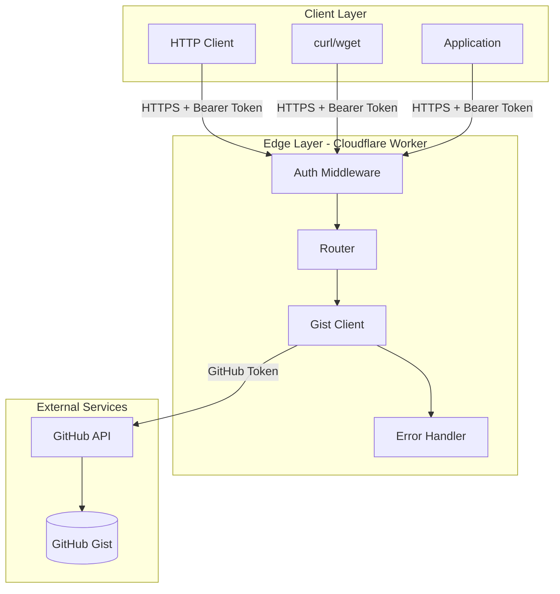
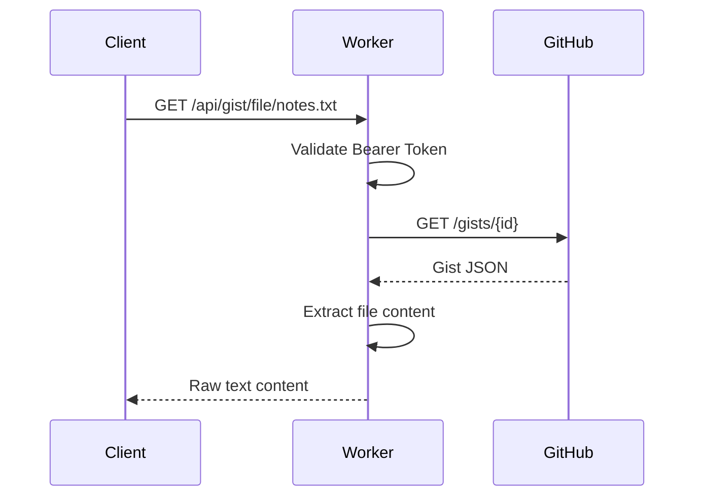
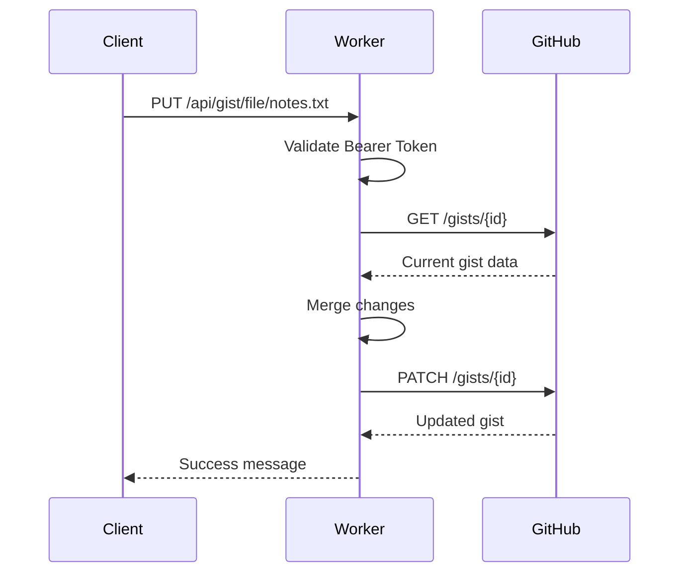
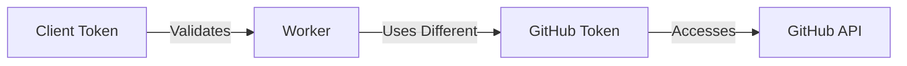

# System Patterns

## Architecture Overview



## Core Design Patterns

### 1. Middleware Pattern
```typescript
// Authentication middleware validates Bearer token
// Executes before all route handlers
middleware(auth) -> middleware(cors) -> handler
```

### 2. Repository Pattern
```typescript
// GistClient encapsulates all GitHub API interactions
class GistClient {
  get(filename?: string)
  create(filename: string, content: string)
  update(filename: string, content: string)
  delete(filename: string)
}
```

### 3. Error Boundary Pattern
```typescript
// Centralized error handling
try {
  // Route logic
} catch (error) {
  // Consistent error response
  return new Response(errorMessage, { status: errorCode })
}
```

## Request Flow

### GET File Content


### UPDATE File Content


## Component Relationships

### Module Structure
```
index.ts
  ├── imports auth.ts
  ├── imports routes.ts
  └── imports gist-client.ts
  
auth.ts
  └── exports authMiddleware
  
routes.ts
  ├── imports gist-client.ts
  └── exports route handlers
  
gist-client.ts
  └── exports GistClient class
```

### Dependency Flow
- **Minimal external dependencies**: Only Hono framework
- **Internal dependencies**: Clear separation of concerns
- **No circular dependencies**: Unidirectional flow

## Error Handling Strategy

### Error Types
1. **Authentication Errors** (401)
   - Invalid Bearer token
   - Missing authorization header

2. **Resource Errors** (404)
   - File not found in gist
   - Gist not found

3. **Client Errors** (400)
   - Invalid filename
   - Missing request body

4. **Server Errors** (500)
   - GitHub API failures
   - Unexpected exceptions

### Error Response Pattern
```
Status: {HTTP_CODE}
Body: {Plain text error message}
```

## Security Patterns

### Token Isolation


### Input Sanitization
- Filename validation: alphanumeric + common extensions
- Path traversal prevention
- Content size limits

## Performance Patterns

### Caching Strategy
1. **No explicit caching** - Rely on GitHub's caching
2. **Stateless design** - No session management
3. **Direct streaming** - Minimal memory usage

### Response Optimization
- Raw text responses (no JSON overhead)
- Minimal processing in worker
- Direct pass-through where possible

## Deployment Pattern

### Environment-Based Configuration
```
Development:
  - Local Wrangler server
  - Test tokens
  - Verbose logging

Production:
  - Cloudflare edge
  - Secure tokens
  - Minimal logging
```

### Zero-Downtime Deployment
1. Build and validate locally
2. Deploy to Cloudflare (automatic rollout)
3. Instant global propagation
4. Automatic rollback on errors

## Extension Points

### Future Enhancements
1. **Rate Limiting** - Add request throttling
2. **Caching Layer** - Cloudflare KV for frequently accessed files
3. **Webhooks** - Notify on content changes
4. **Multiple Gists** - Support multiple gist IDs

### Integration Patterns
- **CI/CD**: Update configs via API
- **Static Sites**: Fetch dynamic content
- **Monitoring**: Export metrics to external services
- **Backup**: Periodic gist snapshots
